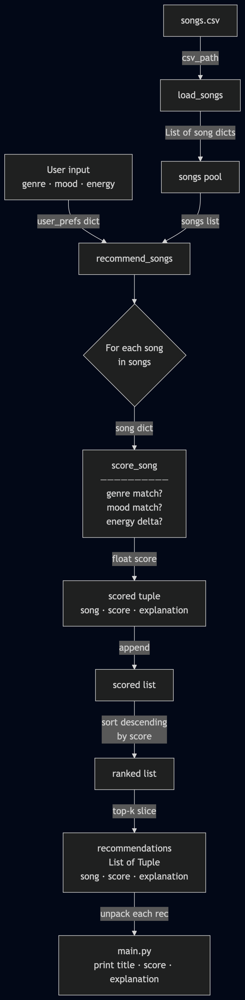
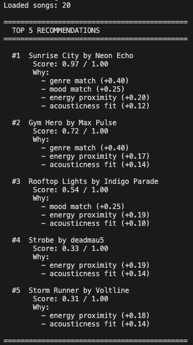
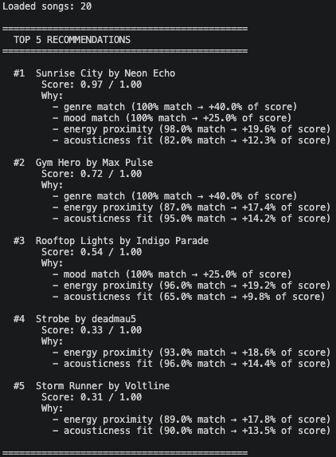
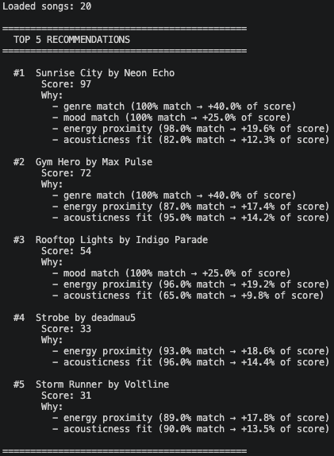
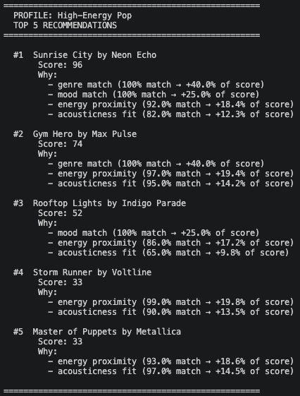
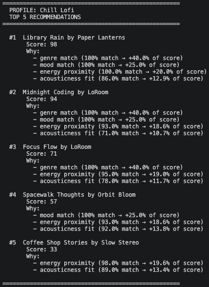
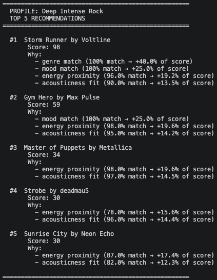
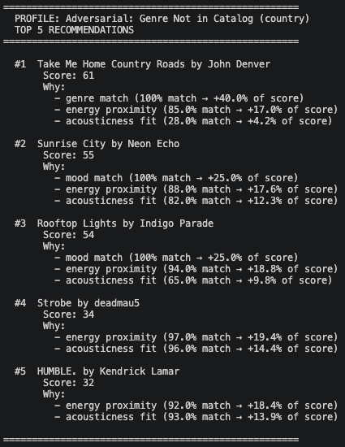
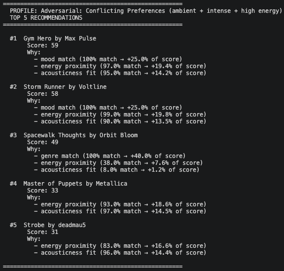
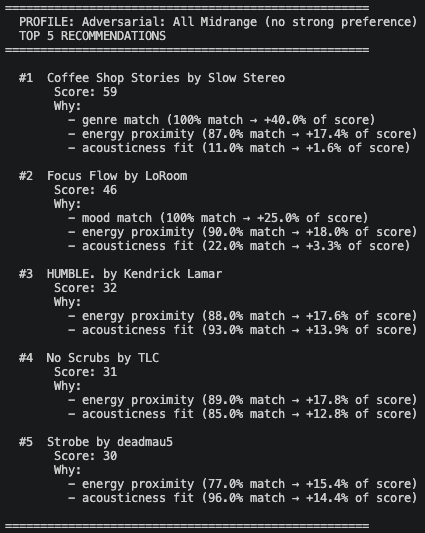

# 🎵 Music Recommender Simulation

## Project Summary

In this project you will build and explain a small music recommender system.

Your goal is to:

- Represent songs and a user "taste profile" as data
- Design a scoring rule that turns that data into recommendations
- Evaluate what your system gets right and wrong
- Reflect on how this mirrors real world AI recommenders

Built with assistance from Claude AI

---

## How The System Works

- What features does each `Song` use in your system
  - The music recommender will use the following attributes:
    - `energy, tempo_bpm, valence, danceability, acousticness`
- What information does your `UserProfile` store
  - At this current step I have not yet gone through what the `UserProfile` will save/store. This will be re-visited later in the assignment.
- How does your `Recommender` compute a score for each song
  - The recommender computes a score 40% based on genre, 25% based on mood match, 20% based on energy proximity, and 15% on acousticness preference match.
- How do you choose which songs to recommend
  - The system will choose whichever song has the highest score and in case of a tie it will be randomized. 


- Image was produced by mermaid.live
---

## Getting Started

### Setup

1. Create a virtual environment (optional but recommended):

   ```bash
   python -m venv .venv
   source .venv/bin/activate      # Mac or Linux
   .venv\Scripts\activate         # Windows

2. Install dependencies

```bash
pip install -r requirements.txt
```

3. Run the app:

```bash
python -m src.main
```

### Running Tests

Run the starter tests with:

```bash
pytest
```

You can add more tests in `tests/test_recommender.py`.

## Initial Output Layout

## Second Iteration of Output Layout

## Final Output Layout


---

## User Profile Runs

### Standard Profiles

#### High-Energy Pop


#### Chill Lofi


#### Deep Intense Rock


### Adversarial / Edge Case Profiles

#### Genre Not in Catalog (Country)


#### Conflicting Preferences (Ambient + Intense + High Energy)


#### All Midrange


---

## Experiments You Tried

- Running six user profiles (three standard, three adversarial) showed that the system works well when genre and mood align with the catalog, but produces compressed, hard-to-differentiate results when the preferred genre is missing or preferences conflict with each other.

---

## Limitations and Risks

Summarize some limitations of your recommender.

- The limitation that this recommender currently has is that it does not know what to do with unknown genres and thus the largest portion of the recommender score is missing. 

---

## Reflection

Read and complete `model_card.md`:

[**Model Card**](model_card.md)

- Recommenders take the data provided and try to find correlations between each set to provide valueable feedback. This would usuaully be done by supervised learning and not blindly guessing on an algorithm like was done in this project. 


